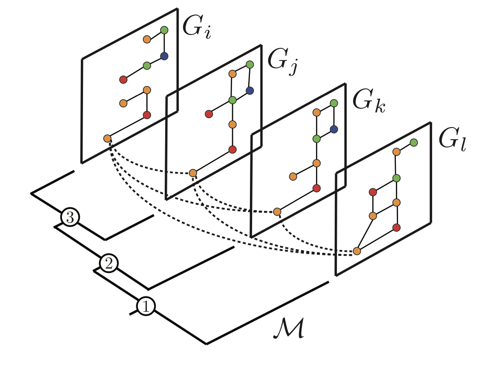
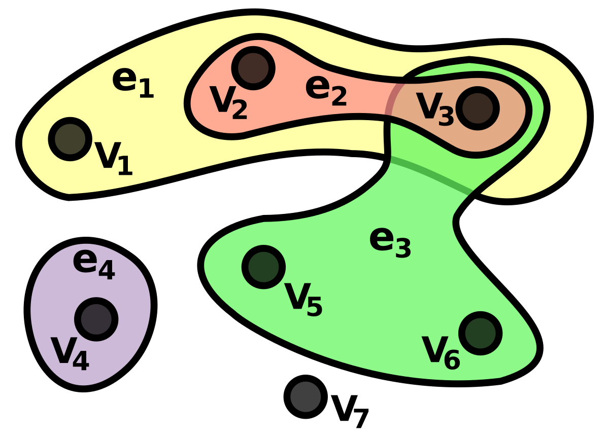

# Hypergraph Extensions for Biololgical Networks


Nel corso degli ultimi anni lo sviluppo del *deep learning geometrico* ha portato ad una importante crescita degli studi riguardo le capacità di queste reti neurali nella risoluzione di complessi problemi legati ai grafi e ai sistemi rappresentabili come reti. Tuttavia, nonostante l'elevato potenziale di questi modelli rispetto a quelli tradizionali, la capacità di queste particolari reti neurali, così come per le reti tradizionali, è comunque influenzata dalla qualità e dalla struttura dei dati sui quali lavorano.

In questo lavoro, si andrà a considerare un possibile metodo per arricchire i grafi utilizzando i pattern strutturali nascosti per migliorare le performance di diversi task applicati ad essi; in particolare ci focalizzeremo sulle PPI network, i cui nodi rappresentano delle proteine e gli archi descrivono una interazione o una certa soglia di similarità tra le proteine. Lo scopo è enfatizzare l'importanza dei motif, e più nello specifico di questo lavoro, le clique di diversa taglia, come pattern strutturale per le reti biologiche.

<table border="0">
    <tr>
        <td>
            
        </td>
        <td>
            
        </td>
    </tr>
</table>

## Installazione

```
python3 -m pip install -r requirements.txts
# Install torch according to your machine specifications
conda install pyg -c pyg
```

## Riproduzione degli esperimenti

Al fine di trasformare il grafo in un ipergrafo utilizzando la tecnica descritta in questo progetto, eseguire il comando `python3 prepare_dataset.py`.

